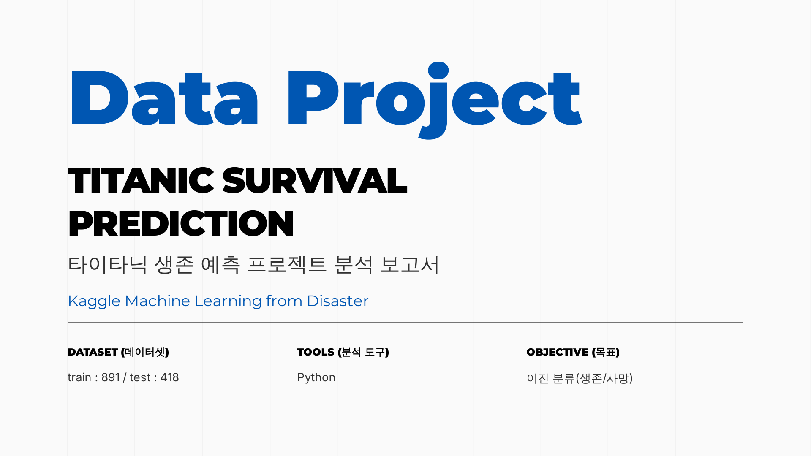
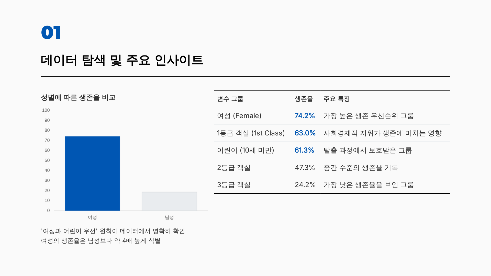
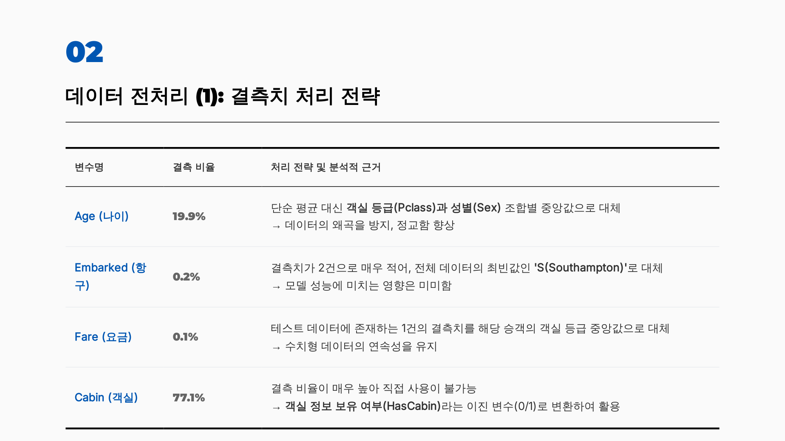
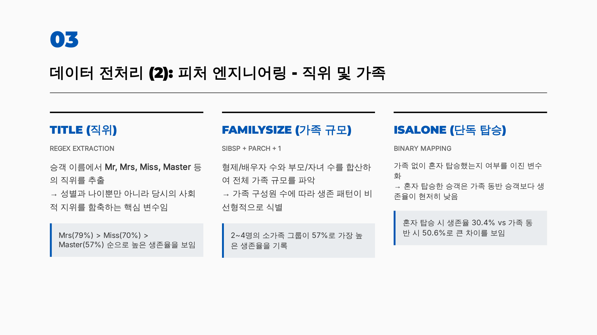
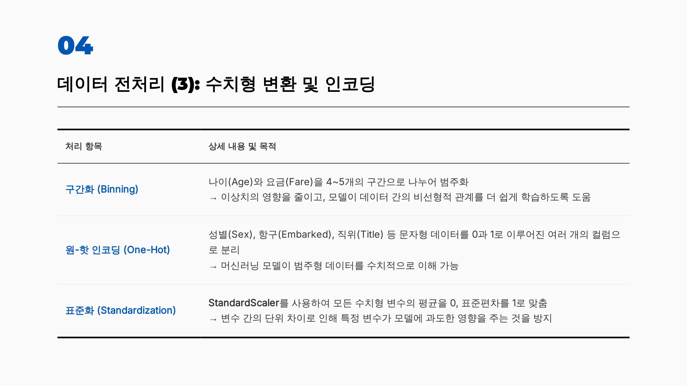
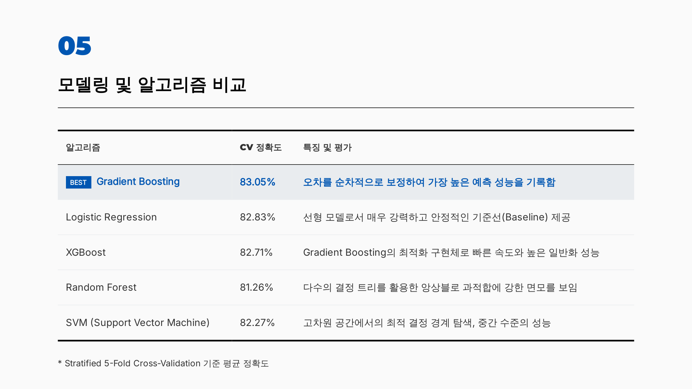
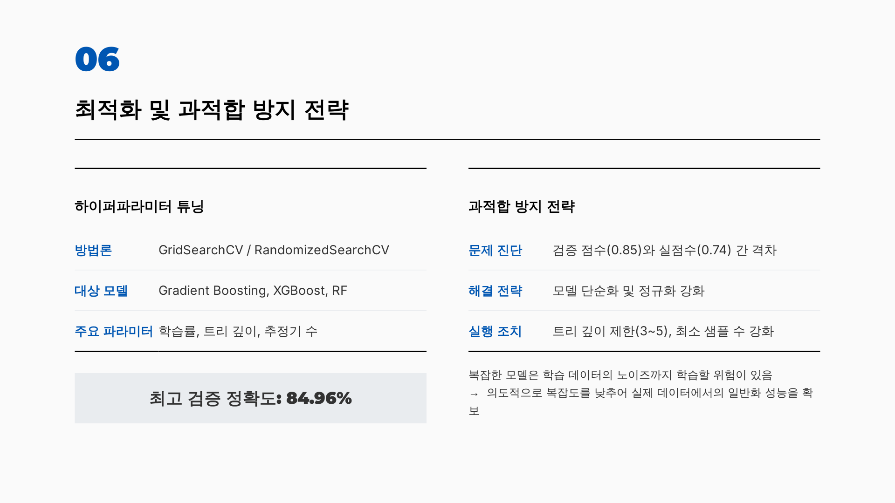
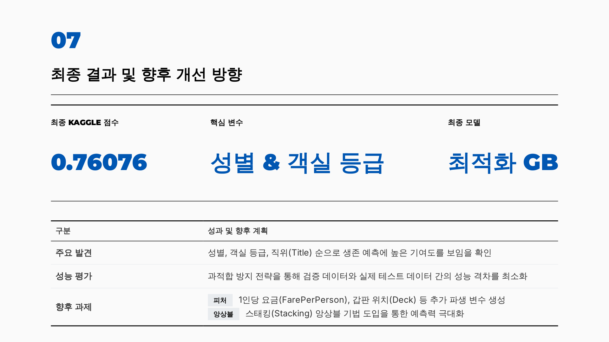

# Titanic Survival Prediction

**타이타닉 생존 예측 프로젝트 분석 보고서**

*Kaggle Machine Learning from Disaster*

---

| DATASET | TOOLS | OBJECTIVE |
|---------|-------|-----------|
| train: 891 / test: 418 | Python | 이진 분류 (생존 / 사망) |

---

## 01. 데이터 탐색 및 주요 인사이트

> '여성과 어린이 우선' 원칙이 데이터에서 명확히 확인.
> 여성의 생존율은 남성보다 약 **4배** 높게 식별.

| 변수 그룹 | 생존율 | 주요 특징 |
|-----------|--------|-----------|
| 여성 (Female) | **74.2%** | 가장 높은 생존 우선순위 그룹 |
| 1등급 객실 (1st Class) | **63.0%** | 사회경제적 지위가 생존에 미치는 영향 |
| 어린이 (10세 미만) | **61.3%** | 탈출 과정에서 보호받은 그룹 |
| 2등급 객실 | 47.3% | 중간 수준의 생존율 기록 |
| 3등급 객실 | 24.2% | 가장 낮은 생존율을 보인 그룹 |

---

## 02. 데이터 전처리 (1): 결측치 처리 전략

| 변수명 | 결측 비율 | 처리 전략 및 분석적 근거 |
|--------|-----------|--------------------------|
| `Age` (나이) | 19.9% | 단순 평균 대신 **객실 등급(Pclass) × 성별(Sex) 조합별 중앙값**으로 대체 → 데이터의 왜곡을 방지, 정교함 향상 |
| `Embarked` (항구) | 0.2% | 결측치가 2건으로 매우 적어 전체 데이터의 최빈값인 **'S(Southampton)'** 로 대체 → 모델 성능에 미치는 영향 미미 |
| `Fare` (요금) | 0.1% | 테스트 데이터에 존재하는 1건의 결측치를 해당 승객의 **객실 등급 중앙값**으로 대체 → 수치형 데이터의 연속성 유지 |
| `Cabin` (객실) | 77.1% | 결측 비율이 매우 높아 직접 사용 불가 → **객실 정보 보유 여부(HasCabin)** 라는 이진 변수(0/1)로 변환하여 활용 |

---

## 03. 데이터 전처리 (2): 피처 엔지니어링 — 직위 및 가족

### TITLE (직위) — Regex Extraction
승객 이름에서 Mr, Mrs, Miss, Master 등의 직위를 추출.
→ 성별과 나이뿐만 아니라 당시의 **사회적 지위**를 함축하는 핵심 변수.

> Mrs **(79%)** > Miss **(70%)** > Master **(57%)** 순으로 높은 생존율

### FAMILYSIZE (가족 규모) — SibSp + Parch + 1
형제/배우자 수와 부모/자녀 수를 합산하여 전체 가족 규모 파악.
→ 가족 구성원 수에 따라 생존 패턴이 **비선형적**으로 식별.

> 2~4명의 소가족 그룹이 **57%** 로 가장 높은 생존율 기록

### ISALONE (단독 탑승) — Binary Mapping
가족 없이 혼자 탑승했는지 여부를 이진 변수화.
→ 혼자 탑승한 승객은 가족 동반 승객보다 생존율이 현저히 낮음.

> 혼자 탑승 시 **30.4%** vs 가족 동반 시 **50.6%** 로 큰 차이

---

## 04. 데이터 전처리 (3): 수치형 변환 및 인코딩

| 처리 항목 | 상세 내용 및 목적 |
|-----------|------------------|
| **구간화 (Binning)** | 나이(Age)와 요금(Fare)을 4~5개의 구간으로 범주화 → 이상치의 영향을 줄이고, 모델이 비선형적 관계를 더 쉽게 학습 |
| **원-핫 인코딩 (One-Hot)** | 성별(Sex), 항구(Embarked), 직위(Title) 등 문자형 데이터를 0과 1로 이루어진 여러 컬럼으로 분리 → 머신러닝 모델이 범주형 데이터를 수치적으로 이해 가능 |
| **표준화 (Standardization)** | `StandardScaler`를 사용해 모든 수치형 변수의 평균을 0, 표준편차를 1로 조정 → 변수 간 단위 차이로 인해 특정 변수가 모델에 과도한 영향을 주는 것 방지 |

---

## 05. 모델링 및 알고리즘 비교

*Stratified 5-Fold Cross-Validation 기준 평균 정확도*

| 알고리즘 | CV 정확도 | 특징 및 평가 |
|----------|-----------|--------------|
| ⭐ **Gradient Boosting** | **83.05%** | 오차를 순차적으로 보정하여 가장 높은 예측 성능 기록 |
| Logistic Regression | 82.83% | 선형 모델로서 매우 강력하고 안정적인 기준선(Baseline) 제공 |
| XGBoost | 82.71% | Gradient Boosting의 최적화 구현체로 빠른 속도와 높은 일반화 성능 |
| SVM | 82.27% | 고차원 공간에서의 최적 결정 경계 탐색, 중간 수준의 성능 |
| Random Forest | 81.26% | 다수의 결정 트리를 활용한 앙상블로 과적합에 강한 면모 |

---

## 06. 최적화 및 과적합 방지 전략

### 하이퍼파라미터 튜닝

| 항목 | 내용 |
|------|------|
| 방법론 | GridSearchCV / RandomizedSearchCV |
| 대상 모델 | Gradient Boosting, XGBoost, Random Forest |
| 주요 파라미터 | 학습률, 트리 깊이, 추정기 수 |
| **최고 검증 정확도** | **84.96%** |

### 과적합 방지 전략

| 항목 | 내용 |
|------|------|
| 문제 진단 | 검증 점수(0.85)와 실점수(0.74) 간 격차 발생 |
| 해결 전략 | 모델 단순화 및 정규화 강화 |
| 실행 조치 | 트리 깊이 제한(3~5), 최소 샘플 수 강화 |

> 복잡한 모델은 학습 데이터의 노이즈까지 학습할 위험이 있음.
> → 의도적으로 복잡도를 낮추어 실제 데이터에서의 **일반화 성능** 확보.

---

## 07. 최종 결과 및 향후 개선 방향

| 최종 Kaggle 점수 | 핵심 변수 | 최종 모델 |
|:---:|:---:|:---:|
| **0.76076** | 성별 & 객실 등급 | 최적화 Gradient Boosting |

| 구분 | 내용 |
|------|------|
| **주요 발견** | 성별, 객실 등급, 직위(Title) 순으로 생존 예측에 높은 기여도를 보임을 확인 |
| **성능 평가** | 과적합 방지 전략을 통해 검증 데이터와 실제 테스트 데이터 간의 성능 격차를 최소화 |
| **향후 과제 — 피처** | 1인당 요금(FarePerPerson), 갑판 위치(Deck) 등 추가 파생 변수 생성 |
| **향후 과제 — 앙상블** | 스태킹(Stacking) 앙상블 기법 도입을 통한 예측력 극대화 |

---

## 파일 구조

```
├── titanic_analysis.ipynb   # 전체 분석 노트북 (EDA → 모델 → 최적화 → 결론)
├── slides/                  # 프로젝트 보고서 슬라이드 이미지
├── train.csv                # 학습 데이터 (정답 포함, 891명)
├── test.csv                 # 테스트 데이터 (정답 없음, 418명)
├── gender_submission.csv    # Kaggle 제출 양식 샘플
└── submission.csv           # 최종 예측 결과 (Kaggle 제출용)
```

---

## 실행 방법

```bash
# 패키지 설치
pip install numpy pandas matplotlib seaborn scikit-learn xgboost jupyter

# 노트북 실행
jupyter notebook titanic_analysis.ipynb
```

열리면 `Kernel → Restart & Run All` 클릭 → 전체 실행 후 `submission.csv` 자동 생성.

---

## 프로젝트 보고서 슬라이드









